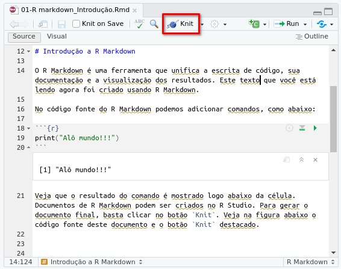
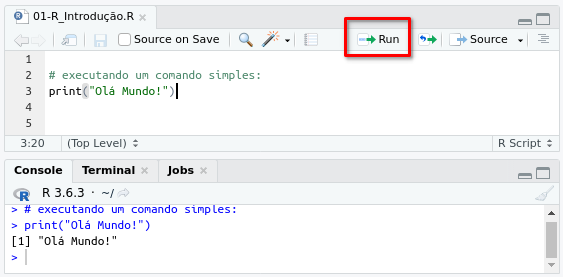

```{r setup, include=FALSE}
knitr::opts_chunk$set(echo = TRUE)
```


O R Markdown é uma ferramenta que unifica a escrita de código, sua documentação e a visualização dos resultados. Este texto que você está lendo agora foi criado usando R Markdown. 

No código fonte do R Markdown podemos adicionar comandos, como abaixo:

```{r}
print("Alô mundo!!!")
```
Veja que o resultado do comando é mostrado logo abaixo da célula. Documentos de R Markdown podem ser criados no R Studio. Para gerar o documento final, basta clicar no botão `Knit`. Veja na figura abaixo o código fonte deste documento e o botão `Knit` destacado.



O código fonte de documentos R Markdown tem a extensão `Rmd`. O código que gerou este documento está no arquivo `01-R markdown_Introdução.Rmd` e pode ser aberto no R Studio.

## Formatação

É possivel formatar a documentação de diversas formas. A linguagem usada para fazer a formatação é chamada *Markdown*. Ela permite diversas coisas como:

- Listas
- *Itálico*
- **Negrito**
- Fórmulas matemáticas: $f(x)=x²+2x+log_2x$
- Links: [UTFPR](http://www.utfpr.edu.br)

Para conhecer outras possibilidades de uso de *Markdown*, veja este [documento](https://raw.githubusercontent.com/rstudio/cheatsheets/main/rmarkdown.pdf).


Claro, o R Markdown permite códigos e visualizações mais complexas como no exemplo abaixo. 


```{r diamonds, message=FALSE}
library(ggplot2)

ggplot(diamonds) + geom_point(aes(x=carat, y=price, color=cut)) + geom_smooth(aes(x=carat, y=price, color=cut))
```

O R Markdown é excelente para a documentação de projetos e será usado em todos os demais tutoriais. Mas se você preferir executar o código R diretamente, basta copiar o código e colar no editor do R Studio, como no exemplo abaixo:



